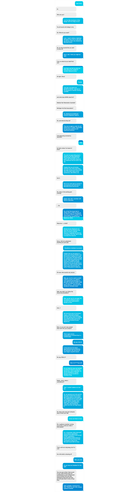

[](https://github.com/redbadger/rusty-azure/actions/workflows/ci.yml)[](https://app.netlify.com/sites/extending-azure-sdk-for-rust/deploys)

# Rust Lightning talk

## What is it

Is a website built with React and hosted on Netlify with a lightning talk for the upcoming Rust London April 20201 meetup.

## Website

**[https://extending-azure-sdk-for-rust.netlify.app/](https://extending-azure-sdk-for-rust.netlify.app/)**

## Installation

1. Clone this repo

   ```sh
   git clone git@github.com:redbadger/rusty-azure.git
   ```

2. Install dependencies

   ```sh
   yarn
   ```

## Development

    ```sh
    yarn start
    ```

## Deployment

We set a [GitHub action](./.github/workflows/ci.yml) that is trigering a deployment to Netlify.

1. Create a git tag with the following syntax, `R.*`, e.g:

   ```sh
   git tag R.1
   ```

2. Push tag to origin

   ```sh
   git push --tags
   ```

## How it looks


